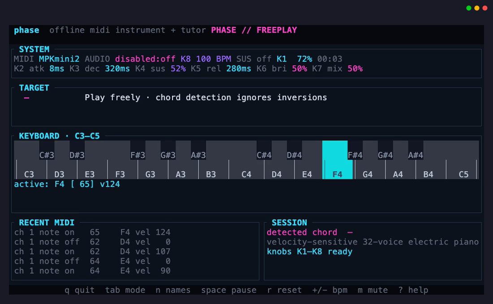
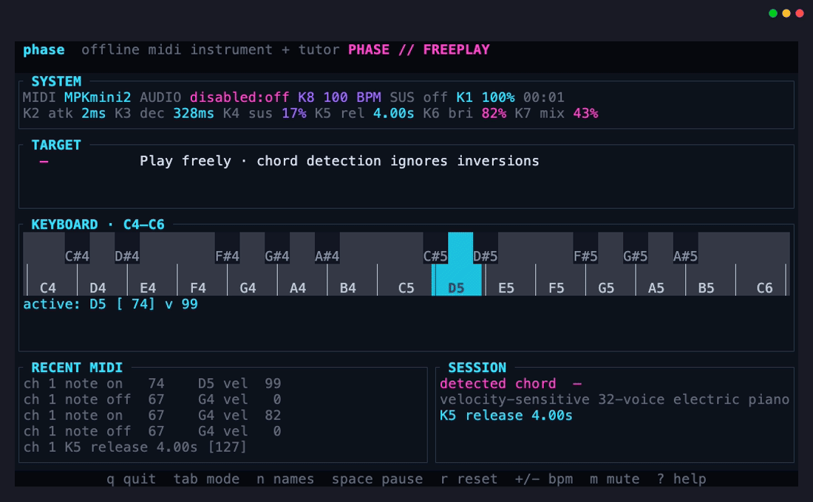

# phase

`phase` is an offline terminal MIDI instrument and interactive piano tutor. It connects directly to the system MIDI and audio backends, synthesizes a velocity-sensitive electric-piano patch, and renders a focused terminal interface. It needs no DAW, network service, external synthesizer, or SoundFont.

## Screenshot



## Video

[](assets/phase-demo.mp4)

[Watch or download the MP4 demo](assets/phase-demo.mp4).

## Platform support

`phase` targets the major desktop operating systems through its cross-platform dependencies:

- **macOS** — CoreMIDI through `midir` and CoreAudio through `cpal`.
- **Linux** — ALSA for MIDI and audio. Building requires the ALSA development files (`libasound2-dev` on Debian/Ubuntu or `alsa-lib-devel` on Fedora).
- **Windows 8 or newer** — WinMM through `midir` and WASAPI through `cpal`.

The application uses the portable APIs exposed by `midir`, `cpal`, `crossterm`, and `directories`. Apple Silicon has received manual MIDI, audio, and terminal testing; Linux and Windows are expected to work from the available dependency backends but have not yet received equivalent project-level verification. Mobile and web targets are not currently supported.

## Build and run

Rust 1.85 or newer is required for edition 2024:

```sh
cargo build --release
./target/release/phase
```

The application prefers a MIDI input containing `MPKmini2` (case-insensitive). If it is absent and exactly one input exists, that input is used. Select devices explicitly when needed:

```sh
./target/release/phase devices
./target/release/phase --midi-port MPKmini2
./target/release/phase --audio-device "Speakers"
./target/release/phase --demo
./target/release/phase --demo --no-audio
```

Inspect decoded controller traffic without starting the TUI:

```sh
./target/release/phase monitor
./target/release/phase monitor --duration 10
```

CI and noninteractive environments can exercise MIDI parsing/state, offline synthesis, and an 80×24 render:

```sh
./target/release/phase --smoke-test --no-audio
```

## Interface

The five modes are:

- **freeplay** — immediate synthesis, held/sustained-note visualization, raw velocity, and inversion-independent triad/seventh chord detection.
- **notes** — randomized targets in the configured MIDI range, response timing, accuracy, streaks, and weak-note tracking. Press `h` to hide note names.
- **staff** — sight-read one of 20 beginner songs one line at a time. Note names appear beneath the staff, the current note is marked, and progress advances only after the expected note is played. Press `Enter` or `s` to choose from the full song menu and use `↑` / `↓` to switch clefs.
- **scales** — chromatic, major, natural minor, and major/minor pentatonic practice, ascending and descending, with recent mistakes and completion time.
- **rhythm** — audible/visible beat practice with signed offsets. Grades are perfect at ±35 ms, good at ±80 ms, early/late through ±180 ms, and miss outside that window.

Controls:

| Key | Action |
| --- | --- |
| `q` | Quit |
| `Tab` / `Shift-Tab` | Next / previous mode |
| `Space` | Pause / resume |
| `r` | Restart current exercise |
| `Enter` / `s` | Open the staff song menu |
| `←` / `→` | Change scale root |
| `↑` / `↓` | Change scale or staff clef |
| `+` / `-` | Adjust BPM |
| `m` | Mute |
| `[` / `]` | Adjust master volume |
| `n` | Toggle Letters / Fixed Do note names |
| `?` | Toggle help overlay |

Terminal keys never generate piano notes; musical input comes only from MIDI or demo mode.
The staff library includes *Twinkle, Twinkle, Little Star*, *Mary Had a Little Lamb*, *Frère Jacques*, *Ode to Joy*, *London Bridge*, *Hot Cross Buns*, *Three Blind Mice*, *Row Your Boat*, *This Old Man*, *Skip to My Lou*, *Au Clair de la Lune*, *Lightly Row*, *Yankee Doodle*, *Amazing Grace*, *Jingle Bells*, *Old MacDonald*, *Happy Birthday*, *Silent Night*, *Oh! Susanna*, and *Pop Goes the Weasel*.
The two-octave keyboard display follows incoming notes in octave steps when they move beyond the visible range.
Press `n` to switch every TUI pitch label between Letters (`C`, `D`, `E`) and Fixed Do (`Do`, `Re`, `Mi`). The selected naming system is saved in configuration; MIDI note numbers and pitches never change.

The default MPK mini knob bank is mapped directly to the instrument:

| Knob / CC | Function | Range |
| --- | --- | --- |
| K1 / CC 1 | Master volume | 0–100% |
| K2 / CC 2 | Envelope attack | 2 ms–1.5 s |
| K3 / CC 3 | Envelope decay | 30 ms–3 s |
| K4 / CC 4 | Envelope sustain | 0–100% |
| K5 / CC 5 | Envelope release | 30 ms–4 s |
| K6 / CC 6 | Timbre brightness | 0–100% |
| K7 / CC 7 | Harmonic mix | 0–100% |
| K8 / CC 8 | Tempo | 40–240 BPM |

The MPK mini Editor can reassign knob CC numbers. `phase` follows CC 1–8 regardless of which physical knob sends them.

## 80×24 mockup

```text
 phase  offline midi instrument + tutor                         PHASE // FREEPLAY
┌ SYSTEM ─────────────────────────────────────────────────────────────────────┐
│MIDI MPKmini2 AUDIO Speakers:on K8 100 BPM SUS off K1 72% 00:42             │
│K2 atk 8ms K3 dec 320ms K4 sus 52% K5 rel 280ms K6 bri 50% K7 mix 50%     │
└─────────────────────────────────────────────────────────────────────────────┘
┌ TARGET ─────────────────────────────────────────────────────────────────────┐
│  C major      Play freely · chord detection ignores inversions             │
└─────────────────────────────────────────────────────────────────────────────┘
┌ KEYBOARD · C3—C5 ───────────────────────────────────────────────────────────┐
│    C#3  D#3       F#3  G#3  A#3     C#4  D#4       F#4  G#4  A#4          │
││    │    │    │    │    │    │    │    │    │    │    │    │    │    │  │
││ C3 │ D3 │ E3 │ F3 │ G3 │ A3 │ B3 │ C4 │ D4 │ E4 │ F4 │ G4 │ A4 │ B4 │C5│
│active: C4 [ 60] v104  E4 [ 64] v 91  G4 [ 67] v 96                       │
└─────────────────────────────────────────────────────────────────────────────┘
┌ RECENT MIDI ──────────────────────────┐┌ SESSION ───────────────────────────┐
│ch 1 note on   67  G4 vel  96         ││detected chord  C major            │
│ch 1 note on   64  E4 vel  91         ││velocity-sensitive 32-voice piano  │
│ch 1 note on   60  C4 vel 104         ││                                   │
└───────────────────────────────────────┘└────────────────────────────────────┘
 q quit  tab mode  n names  space pause  r reset  +/- bpm  m mute  ? help
```

## Architecture

- `main.rs` / `cli.rs` — startup, subcommands, terminal lifecycle, demo and smoke paths.
- `midi.rs` — pure defensive MIDI decoding, `midir` discovery/selection, bounded callback handoff.
- `audio.rs` — `cpal` output stream and allocation-free 32-voice synthesizer. The callback drains a fixed-capacity nonblocking command queue and performs no file I/O, logging, locks, or allocation.
- `music.rs` / `chord.rs` — MIDI note, pitch-class and scale primitives plus inversion-independent chord matching.
- `controls.rs` — MPK CC mapping, musical parameter ranges, patch state, and control labels.
- `trainer.rs` — exercise state, centralized score thresholds and monotonic timing.
- `app.rs` — bounded application state and event transitions, separate from callbacks and rendering.
- `ui.rs` — approximately 30 FPS Ratatui renderer, including the 80×24 compact layout.
- `config.rs` / `stats.rs` — versioned TOML configuration and aggregate practice data.

The MIDI callback sends compact note/pedal commands directly to the bounded audio queue for low latency and separately queues decoded events for the TUI. Queue overflow drops the newest event rather than blocking a real-time-sensitive thread. Synthesis uses sample-rate-independent envelopes, deterministic oldest-voice stealing, smooth release, and finite soft-clipped output.

## Configuration and data

The `directories` crate resolves platform-appropriate paths for the `phase` application. Run `phase` once to create the human-readable versioned files:

- configuration: the project configuration directory, `phase/config.toml`
- practice totals: the project local data directory, `phase/practice.toml`

Configuration stores preferred device substrings, volume, BPM, note naming, training range, and theme. Practice data stores total time, accuracy totals, weak-note counts, and best streaks. A malformed file is nonfatal: `phase` uses safe defaults and displays a warning.

## Troubleshooting

- Run `phase devices` first. If several MIDI inputs exist and none is `MPKmini2`, pass `--midi-port <substring>`.
- Use `phase monitor --duration 10` to confirm incoming MIDI events. Note-on velocity zero is decoded as note-off.
- If audio cannot open, inspect the listed output name, pass `--audio-device <substring>`, or use `--no-audio` while diagnosing it.
- If the terminal is too small, enlarge it to at least 80×24. The panic hook and terminal guard restore raw mode, cursor visibility, mouse capture, and the original screen on exit.
- Demo mode works without hardware: `phase --demo`.

## Development checks

```sh
cargo fmt --check
cargo test
cargo clippy --all-targets --all-features -- -D warnings
cargo build --release
./target/release/phase --smoke-test --no-audio
```

Licensed under the MIT License.
